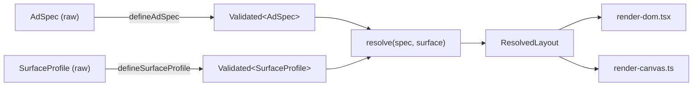

# Architecture

`src/resolver.ts`, `spec.ts`, `surfaces.ts`, `types.ts`, and `invariants.ts`
import nothing from React or the DOM. They sit in `src/` alongside the React
files only because the assessment's required submission structure
(`src/spec.ts, surfaces.ts, resolver.ts, render-dom.tsx, App.tsx`) is flat —
not because the core and the UI are entangled. `render-dom.tsx` and
`render-canvas.ts` are the only two files that know a browser exists, and
they're interchangeable consumers of the same `ResolvedLayout` type (see the
DOM/Canvas toggle in the demo app).

## Data flow



`resolve()`'s signature — `(Validated<AdSpec>, Validated<SurfaceProfile>) =>
ResolvedLayout` — only accepts branded inputs, so a spec or surface that
skipped its validator can't be passed in. That's enforced at compile time,
not by a runtime guard at the top of `resolve()`.

## The algorithm

Named constants live at the top of `resolver.ts` as the single source of
truth (`GAP`, `CTA_MIN_WIDTH`, `HERO_MAX_FRACTION_ROW`,
`AXIS_ROW_THRESHOLD`, `FONT_SIZE_BY_ROLE`, etc.) — point at these directly
when asked "why did X end up that size."

**Phase A — Setup.** `contentBox` = surface bounds minus `safeArea`. All
downstream math works only inside this rectangle.
`aspect = contentBox.width / contentBox.height`, and:

```
axisMode = aspect >= 1.35 ? "row" : aspect <= 0.75 ? "column" : "grid2col"
```

This one comparison is the entire surface-specific decision in the whole
algorithm. Everything downstream reads only `axisMode` and the numeric
`contentBox` — never `surface.id`. That's the concrete, demonstrable proof
for "same code path, not hardcoded per surface": grep `resolver.ts` for
`surface.id` and the only hits are in the final output object.

**Phase B — Natural size per element**, computed from role + `axisMode`:
hero images fill the leading axis and are capped on the other one, letting
`fitAspectInBox` do the aspect-preserving fit (never distorted — this is
also why hero's placed rect always uses its own computed width *and*
height, not the region's full box, in every axis mode). Text height is
`fontSize × 1.3`; `fontSize` is `max(role default × viewingDistance scale,
surface.minTextSize, element.minFontSize)`. Buttons are
`max(CTA_MIN_WIDTH, minTapTarget)` × `max(CTA_DEFAULT_HEIGHT,
minTapTarget)`. Branding gets a small fixed-fraction corner box.

**Phase C — Region assignment + packing.** Branding is excluded from the
main flow entirely and placed afterward at whichever of the 4 corners
(bottom-right → top-right → bottom-left → top-left) doesn't overlap
anything and stays inside `contentBox` — a real geometric search, not a
fixed reservation. Everything else is assigned to region(s) generated
mechanically from `axisMode`: one full-box stack for `column`; a hero-led
leading region plus a stacked remainder for `row`; a fixed 55/45 two-column
split for `grid2col`. Within a stack region, elements are placed
top-to-bottom in priority order — one forward cursor pass, no wrapping, no
cross-axis packing (deliberately, per the FAQ's steer away from a general
solver). A region "overflows" if the stack's used height exceeds its
budget, *or* if any element's natural width exceeds the region's width —
both feed the same overflow signal that drives Phase D.

**Phase D — Global priority-ordered degradation loop**, the actual proof of
"genuine adaptation, not scaling":

```
loop:
  recompute regions + branding placement from current element state
  if nothing overflows → done
  candidates = elements with a remaining degradation stage,
               sorted by priority DESC (least important first)
  if candidates empty → throw (surface too small for the undroppable set)
  degrade candidates[0] by one stage; repeat
```

Degradation is **monotonic** — see the Limitations section in the README
for why. Stages: text shrinks in 2px steps to its floor, then truncates
(once), then drops (if `canDrop`); images (including branding) shrink
proportionally to a 20px floor, then drop; buttons only drop. Every stage
application appends a plain-English `warnings[]` line — that's what the
debug panel renders and what gets pointed at when narrating "why is X
here."

**Phase E/F — Hard-constraint + overlap check.** Rather than duplicating
these checks inline, `resolve()` builds the full `ResolvedLayout` and then
calls `checkInvariants(layout, surface, spec)` from `invariants.ts` — the
same function the test suite calls directly against all 5 presets plus 2
synthetic edge surfaces. Any violation throws. This means the "safety net"
and "test assertions" are the same code, not two implementations that could
drift apart.

**Phase G — Output.** `ResolvedLayout` — visible elements only (rounded to
2 decimal places for a clean debug JSON), `droppedElementIds`, and the
`warnings[]` trace.

## Why an unseen 5th surface "just works"

`resolve()` never branches on `surface.id` or any string identity — the
only surface-derived decision points are Phase A's arithmetic, computed
purely from numeric fields every `SurfaceProfile` has. A brand-new profile
(say, an 800×1200 tall panel with `minTextSize: 14`) flows through:
`contentBox` → `aspect 0.67` → `axisMode = "column"` → identical
stacking/degradation code to mobile portrait, just different absolute
numbers. Missing optional fields (`touchOnly`, `viewingDistance`) degrade
gracefully via `??` defaults, never crash.

The demo's **Custom Surface** tab wires a JSON textarea to the exact same
`defineSurfaceProfile()` → `resolve()` call the 5 presets use — paste an
unseen surface, hit Resolve, zero code change. Verified live: a
200×900 tall-narrow surface and a 2400×150 ultra-wide surface both resolve
cleanly with zero warnings (see `tests/resolver.test.ts`, "unseen surfaces
(fuzzing the axis thresholds)").

## Type design highlights

- `ElementSpec` is a discriminated union on `type` (`text | image |
  button`). `resolver.ts`'s `hasMoreStages` and `degradeOneStep` both
  `switch` on `spec.type` with a `default: assertNever(spec)` — adding a
  4th element type without handling it in both switches is a compile
  error, not a silent runtime gap.
- `SurfaceProfile`'s touch/non-touch split is a union:
  `{ touchOnly: true; minTapTarget: number } | { touchOnly?: false;
  minTapTarget?: number }`. Writing `{ touchOnly: true }` without
  `minTapTarget` fails to compile — the "invalid constraint combination"
  requirement enforced structurally, not with a runtime check.
- `Validated<T>` is a branded type (`T & { readonly [validated]: true }`)
  with the brand symbol never exported — the only way to produce one is
  through `defineAdSpec` / `defineSurfaceProfile`, so `resolve()`'s
  signature statically forces validation-before-use.
- Runtime validators still exist alongside the compile-time guarantees,
  because specs built from untyped JSON (like the Custom Surface textarea)
  bypass the type system entirely — `defineAdSpec` / `defineSurfaceProfile`
  throw an `Error` listing every violation found, not just the first.

## Pitfalls this design avoids

- **Hardcoded branches disguised as a resolver** — `surface.id` never
  appears in placement logic.
- **CSS media queries deciding placement** — `render-dom.tsx` has zero
  `@media` rules; every geometry value comes from the resolver's output.
  The demo's `transform: scale()` preview wrapper is cosmetic fit only —
  the resolver always computes true, unscaled pixels.
- **Uniform scaling passed off as adaptation** — `axisMode` changes
  *composition* (row/column/grid2col), not a scale factor. Compare mobile
  portrait (hero stacked with text) against broadcast lower-third (hero as
  a leading band beside the text) in the demo — same spec, same resolver,
  structurally different output.
- **Silent overlap/clipping** — `checkInvariants` runs both inside
  `resolve()` and across every preset + edge case in the test suite.
- **Over-engineering the solver** — one forward sizing pass + one backward
  degradation loop. No iterative relaxation, no backtracking, no simplex.
