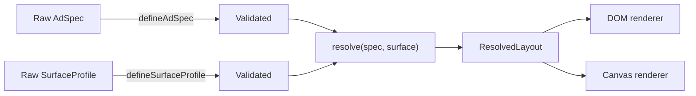

# Architecture

The project is intentionally split into four layers:

```text
spec + surface definitions
  -> validation
  -> resolver
  -> resolved layout
  -> renderer
```

The core engine files (`src/spec.ts`, `src/surfaces.ts`, `src/resolver.ts`,
`src/types.ts`, and `src/invariants.ts`) do not import React, DOM, Canvas, or
CSS. `src/render-dom.tsx` and `src/render-canvas.ts` are consumers of the same
`ResolvedLayout` contract.

## Data Flow



`resolve()` accepts only `Validated<AdSpec>` and
`Validated<SurfaceProfile>`. The brand type forces callers to pass through the
validators before layout resolution.

## Input Model

The ad spec defines semantic intent once:

- `headline` - primary text
- `price` - commercial text
- `secondary` - supporting text
- `hero-image` - main product visual
- `cta` - action button
- `branding` - brand mark

The resolver assumes one slot per role. `defineAdSpec()` enforces that
assumption by rejecting duplicate roles, duplicate IDs, empty content, invalid
role/type pairings, non-positive priorities, bad image aspect ratios, and
malformed optional flags.

Surface profiles provide real constraints, not just size:

- `safeArea` defines the content rectangle
- `minTextSize` sets a hard type floor for text and CTA labels
- `touchOnly` plus `minTapTarget` sets button hit-target floors
- `viewingDistance: "far"` increases the type scale for broadcast-style use

`defineSurfaceProfile()` rejects malformed custom JSON, non-finite dimensions,
invalid safe areas, missing tap targets on touch surfaces, and invalid enum
values.

## Resolver Phases

### 1. Content Box

The surface bounds are reduced by `safeArea`. All placement happens inside
that content box. The invariant checker rejects anything outside it.

### 2. Continuous Sizing

The resolver computes one base type size from content-box area and height:

```text
base = f(sqrt(width * height), height, viewingDistance)
```

Role multipliers derive headline, price, and secondary text from that base.
Hard floors then apply:

- text uses `max(surface.minTextSize, TYPE_MIN, element.minFontSize)`
- CTA labels use `max(surface.minTextSize, CTA_FONT_MIN)`
- touch CTAs use `minTapTarget` for both width and height floors

This lets a kiosk get larger type than a small widget without maintaining a
surface-name lookup table.

### 3. Template Selection

The resolver chooses one of four templates from numeric constraints:

- `stack` - hero above copy; used for portrait or narrow content boxes
- `split` - hero column plus copy/CTA column; used for square and landscape
  boxes with enough absolute width
- `banner` - hero, copy, and CTA in separate horizontal zones; used for very
  wide strips
- `micro` - hero-dominant top region plus a compact bottom bar; used when both
  dimensions are too small for ordinary stack behavior

The decision is based on content-box aspect ratio and capacity gates. The code
does not branch on `surface.id` for placement.

Before a side-by-side template is committed, the resolver checks whether the
undroppable headline can fit the actual copy column at its required floor. If
the column would force an unbreakable or over-line headline, the template falls
back to `stack` so the copy can use the full width before the resolver gives up.

### 4. Composition

Composition is a pure pass over the current element states. It returns:

- a rectangle for each placed element
- resolver-chosen text lines
- effective font sizes
- an overflow flag

The hero image is elastic. In `stack`, it takes the vertical space left by the
copy. In `split` and `banner`, it takes a side column only after the text
column keeps its minimum readable width. In `micro`, the hero gets a dominant
top share first, because tiny square surfaces otherwise starve the image.

Text wrapping is computed by the resolver with a deterministic glyph-width
estimate. Renderers draw the lines they are handed; they do not decide wrapping
or placement.

### 5. Priority Degradation

If composition overflows, the resolver degrades exactly one element and
recomposes from scratch.

```text
while composition overflows:
  candidates = visible elements with remaining degradation stages
  sort candidates by priority descending
  degrade the first candidate
  recompose
```

Higher numeric priority means less important, so priority `5` degrades before
priority `1`. Degradation is monotonic and deterministic.

Stages by type:

- text: shrink to its floor, then truncate if allowed, then drop if allowed
- branding/non-hero image: shrink proportionally, then drop
- hero image: use elastic sizing first, then drop only if allowed
- button: preserve tap/text floors; drop only if allowed

Each step adds a human-readable `warnings[]` entry. The demo debug panel shows
the exact trace used to produce the final layout.

### 6. Output And Invariants

The output is a `ResolvedLayout`:

- surface and spec IDs
- surface dimensions
- selected template
- visible `ResolvedElement[]`
- `droppedElementIds`
- degradation warnings

Before returning, `resolve()` runs `checkInvariants()`:

- no overlaps
- no visible element outside the safe content box
- touch buttons satisfy `minTapTarget`
- text and CTA labels satisfy `minTextSize`
- every input element is either visible or reported dropped
- no unknown or duplicated output IDs
- a higher-priority element is not dropped while a lower-priority element
  survives

If an element is still visible but receives no rectangle, the resolver throws
immediately. That keeps composition bugs from becoming invisible output gaps.

## Why Unknown Surfaces Work

A new surface needs no resolver code change because the resolver reads only
the profile's numeric constraints and enum fields:

```text
width, height, safeArea, minTextSize, minTapTarget, viewingDistance
```

The Custom Surface tab parses JSON, validates it with `defineSurfaceProfile()`,
and passes it into the same `resolve()` call as the presets. The test suite also
sweeps many synthetic width/height combinations to catch threshold failures.

## Renderer Boundary

Renderers receive already-resolved absolute geometry. CSS is allowed to draw
the final boxes, transitions, typography, and preview scaling, but CSS does not
choose which composition is used.

This keeps the architecture open to new renderers: Canvas already consumes the
same `ResolvedElement[]`, and a print or server-side renderer would follow the
same boundary.

## Known Limits

- The text measurement model is deterministic but approximate. A production
  engine would inject real font measurement.
- Degradation does not backtrack or grow elements after later drops free space.
- The priority ladder is global rather than tied to the overflowing region.
- The supported element types are deliberately narrow: text, image, and
  button.
- Surfaces smaller than the undroppable headline plus CTA can still fail, but
  they fail explicitly instead of clipping.
